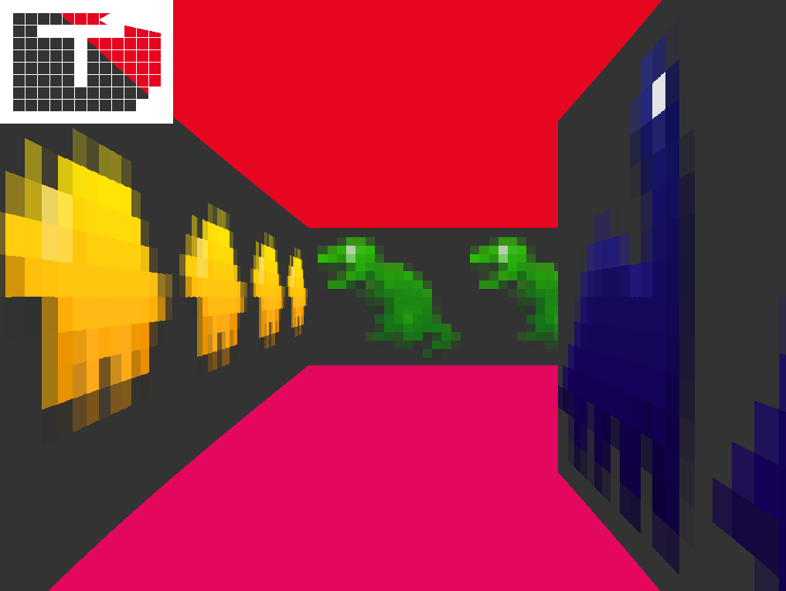

# Cub3D - 3D Raycasting Engine

A 3D raycasting engine inspired by the classic game Wolfenstein 3D, built as part of the 42 School curriculum. This project creates a realistic 3D perspective from a 2D map using raycasting techniques.



## 🎮 Features

- **3D Raycasting**: Real-time 3D rendering using the DDA (Digital Differential Analyzer) algorithm
- **Texture Mapping**: Support for different wall textures based on direction (North, South, East, West)
- **Player Movement**: Smooth WASD movement with mouse rotation
- **Collision Detection**: Realistic wall collision system
- **Minimap**: Real-time minimap showing player position and orientation
- **Customizable Colors**: Configurable floor and ceiling colors
- **Map Validation**: Comprehensive map file validation system

## 🛠️ Technical Implementation

### Core Components

- **Raycasting Engine**: Implements DDA algorithm for efficient ray-wall intersection
- **Texture System**: Loads and applies PNG textures to walls
- **Graphics Pipeline**: Uses MLX42 library for cross-platform graphics rendering
- **Input Handling**: Real-time keyboard and mouse input processing
- **Memory Management**: Proper allocation and deallocation of resources

### Architecture

```
src/
├── main.c                 # Main program entry point
├── cub3d.h               # Main header file with definitions
├── init.c                # Game initialization
├── DDA_*.c               # Raycasting algorithm implementation
├── texture.c             # Texture loading and management
├── player_*.c            # Player movement and controls
├── draw_*.c              # Rendering functions
├── *_parser_*.c          # Map file parsing
├── *_map_check.c         # Map validation
└── utils*.c              # Utility functions
```

### Usage
To run the Cub3D engine, you need to have the MLX42 library installed. Clone the repository and run the following command:

```bash
make
./cub3d maps/basic.cub
```

## 🎯 Controls

| Key | Action |
|-----|--------|
| `W` | Move forward |
| `S` | Move backward |
| `A` | Move left |
| `D` | Move right |
| `←` | Turn left |
| `→` | Turn right |
| `ESC` | Exit game |

## 🗺️ Map File Format

Map files use the `.cub` extension and follow this structure:

```
NO ./textures/north_wall.png
SO ./textures/south_wall.png  
WE ./textures/west_wall.png
EA ./textures/east_wall.png

F 168,86,50    # Floor color (R,G,B)
C 57,170,227   # Ceiling color (R,G,B)

1111111111111
1000000000001
1000000000001
1000N00000001  # N = Player starting position (facing North)
1000000000001
1000000000001
1111111111111
```

### Map Legend
- `1`: Wall
- `0`: Empty space
- `N/S/E/W`: Player starting position and orientation

## 🎨 Customization

### Adding New Textures

1. Place PNG files in the `textures/` directory
2. Update the map file to reference your textures:
   ```
   NO ./textures/your_texture.png
   ```

### Map Creation

Create custom maps by:
1. Designing your layout with `1`s (walls) and `0`s (empty spaces)
2. Ensuring the map is enclosed by walls
3. Placing exactly one player starting position (`N`, `S`, `E`, or `W`)
4. Saving with `.cub` extension

## 🔧 Development

### Building for Development

```bash
make debug    # Build with debug symbols
make clean    # Clean object files
make fclean   # Clean everything
make re       # Rebuild everything
```

### Project Structure

- `lib/`: External libraries (libft, get_next_line, MLX42)
- `src/`: Source code files
- `maps/`: Example map files
- `textures/`: Wall texture files
- `media/`: Screenshots and documentation assets

## 📋 Requirements

This project meets all requirements of the 42 School Cub3D project:

- ✅ 3D raycasting implementation
- ✅ Texture mapping for walls
- ✅ Floor and ceiling color customization
- ✅ Player movement and rotation
- ✅ Map file parsing and validation
- ✅ Memory leak prevention
- ✅ Error handling for invalid inputs


## 🎓 Authors

- **Arthur** - [GitHub](https://github.com/alimpens)
- **Omio** - [GitHub](https://github.com/panndabea)

---

